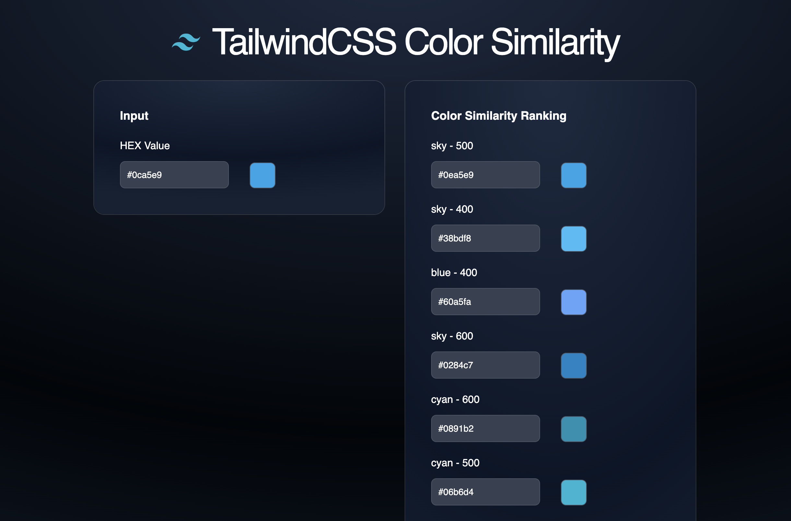

## TailwindCSS Color Distance Calculator

One of the most annoying things about designing a frontend (especially if you are overly left-brained like me) is nitpicking the css to create the perfect sizes, colors, spacing, etc for an element in your UI. This is annoying, since painfully trialing arbitrary values a few pixels at a time will not only slow you down, but it has the potential to create inconsistent and ugly designs.

One of the best things about [Tailwind](https://tailwindcss.com/) is its design system. Out of the box, their design system constrains their users to a prespecified set of values. Now don't get me wrong, it is definitely possible to create an "inconsistent" design in Tailwind, but those are usually attributed to using these guys: `[]`.

So, if you're someone like me and you look at other applications for inspiration, but you want to stick within the Tailwind design system, then this application is for you.

`TailwindCSS Color Distance Calculator` allows you to input a hexadecimal value (currently reserved for hexaecimal's that are of length six) and the application will show you the top 10 most similar colors. It is built with React + TS.

The algorithm used to determine the similarity between the colors is based on the [Delta E Algorithm](http://zschuessler.github.io/DeltaE/learn/).

The application is currently hosted on [Netlify](https://app.netlify.com/) and you may visit it online at [https://tailwind-color-distance-calculator.netlify.app/](https://tailwind-color-distance-calculator.netlify.app/).

## Project Screen Shot

## Using this project locally

Clone down this repository. You will need `node` and `npm` installed globally on your machine.

Installation:

`pnpm install`

To Start Server:

`pnpm run dev`
